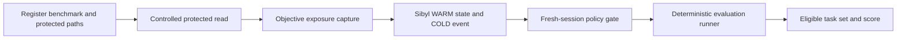
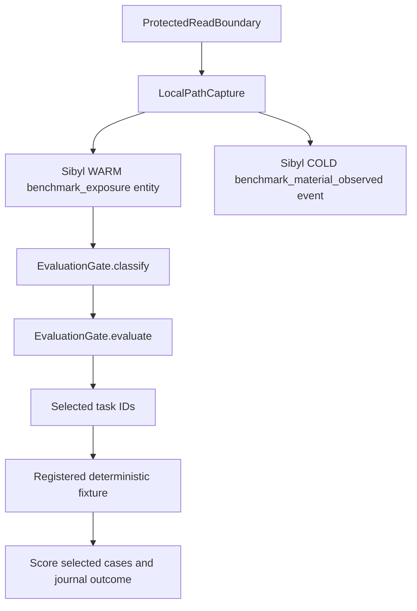

# Skepis

Skepis records objective exposure to protected benchmark material and uses that history to control what a later evaluation may count as clean.

Live demo: not available yet · Video: not available yet · Docs: this README · Repository: [GitHub](https://github.com/CryptoZephyr/Skepis) · Submission: not linked yet

No public screenshot, hosted application, or demo video is included yet. The current proof runs locally from the deterministic fixture and the configured Sibyl Memory client.

Built with: Python 3.11+ · Sibyl Memory client · deterministic local fixture
Status: local proof complete, no public deployment

## The problem

An agent can read a hidden answer, protected test, solution patch, or other benchmark material while it is being developed. When that session ends, a later evaluator may have no record of the exposure. The task can then be counted as clean even though the evaluation is no longer fair.

## What Skepis does

Skepis keeps evaluation eligibility as durable state. A registered protected-resource read maps to one benchmark task, writes exposure to Sibyl, and leaves an append-only event. A fresh evaluation process reads that state and applies the benchmark policy.

The product invariant is simple:

> A task marked exposed by objective evidence cannot contribute to a clean score unless an explicit benchmark policy changes its eligibility.

## How it works

1. Register a benchmark, its task IDs, and its protected local paths.
2. Route a protected read through `skepis exposure read`.
3. Persist the exposure in Sibyl WARM state and append a COLD provenance event.
4. Start a fresh evaluation process. The policy gate partitions tasks into `CLEAN`, `EXPOSED`, and `UNKNOWN`, then runs only the allowed task set.



## Why Sibyl Memory matters

Sibyl is the durable boundary between the process that observes exposure and the process that evaluates the benchmark. WARM state stores current task eligibility. COLD events preserve exposure and evaluation history.

The proof depends on that boundary. After the memory database is removed, a fresh strict evaluation cannot recover the historical exposure. It returns `UNKNOWN`, selects no tasks, and blocks the clean claim.

## Try it

The fastest judge path is the repeatable Checkpoint 12 demo. It creates a fresh temporary project, registers the fixture, shows a clean baseline, performs a controlled read of `checkout-17`, starts a new process to recall the exposure, runs `EXCLUDE`, and proves strict failure after deleting the exact local memory file.

```powershell
$env:PYTHONPATH = "src"
python demo/checkpoint12_demo.py --repeat 1
```

Use `--repeat 3` to run the full repeatability proof. The command prints one JSON record per stage, including process boundaries, capture evidence, task selection, score, and deletion behavior.

## Product / Demo

The current product surface is a local CLI. There is no frontend, hosted endpoint, public demo URL, or video asset yet.

The repeatable demo is [demo/checkpoint12_demo.py](demo/checkpoint12_demo.py). The benchmark fixture is [examples/checkout-benchmark/fixture.json](examples/checkout-benchmark/fixture.json).

## Architecture



Sibyl is authoritative for Skepis operational exposure state. The external read boundary is authoritative for the successful protected-file read. The fixture runner is authoritative for its deterministic task result. Model inference does not create hard exposure state.

## Integration details

| Technology | How we use it | Why it matters |
| --- | --- | --- |
| Sibyl Memory | `MemoryClient.local` stores the scoped WARM entity and COLD events | Exposure survives process and session boundaries |
| Python CLI | `skepis init`, `benchmark register`, `exposure status`, `exposure read`, and `eval run` | The proof is runnable without a web service |
| Local protected-read boundary | Opens the registered in-root file before creating the objective signal | The positive exposure claim has a concrete read receipt |
| Deterministic fixture runner | Scores only the task IDs returned by the policy gate | The evaluation consequence is observable and repeatable |

## What's running

- Local WSL development environment with Python 3.14.4.
- Sibyl Memory client 0.7.0 in the verified environment.
- No public deployment, hosted API, smart contract, or network-specific integration.
- Public GitHub repository: [CryptoZephyr/Skepis](https://github.com/CryptoZephyr/Skepis).

## Evidence

The current evidence was verified on 2026-08-29:

- `demo/checkpoint12_demo.py --repeat 3` completed three fresh temporary projects without repair.
- Each repeat started with `checkout-16`, `checkout-17`, and `checkout-18` clean.
- Session A recorded a controlled `checkout-17` read with a persisted Sibyl event ID and content hash.
- Fresh Session B recalled only `checkout-17` as `EXPOSED`.
- `EXCLUDE` evaluated only `checkout-16` and `checkout-18`, with score `1.0`.
- Exact memory deletion followed by fresh `STRICT` evaluation returned `BLOCKED`, all tasks `UNKNOWN`, no selected or evaluated tasks, and `clean_claim_permitted: false`.
- The configured WSL suite passed 58 tests with 0 skips.
- The Windows suite passed 58 tests with 6 dependency-based skips because its interpreter cannot import the configured Sibyl client for fresh-process proofs.

The complete automated demo assertion is [tests/test_checkpoint12_demo.py](tests/test_checkpoint12_demo.py). The broader source tests are in [tests](tests).

## Failure cases / What we tested

| Attempt | Expected behavior | Result |
| --- | --- | --- |
| Protected `checkout-17` read | Persist exposure and provenance | `RECORDED`, WARM `EXPOSED`, COLD event present |
| `EXCLUDE` after exposure | Keep exposed task out of clean evaluation | `checkout-17` excluded, clean tasks evaluated |
| Missing or deleted Sibyl state | Fail closed | `UNKNOWN`, `BLOCKED` under `STRICT`, no clean claim |
| Failed or ambiguous protected read | Avoid hard exposure and report uncertainty | Read rejected or `INCOMPLETE_MONITORING` gap recorded |
| Missing observation reader or failed gate journal | Avoid a clean claim | Unknown state or unjournaled decision blocks the claim |
| Generic Bash, scripts, MCP, or unsupported Codex routes | Avoid claiming coverage that was not observed | Remain outside the bounded adapter as `INCOMPLETE_MONITORING` |

## Repository structure

```text
.
├── demo/
│   └── checkpoint12_demo.py
├── examples/
│   └── checkout-benchmark/
│       └── fixture.json
├── pyproject.toml
├── src/
│   └── skepis/
│       ├── capture/
│       ├── cli.py
│       ├── config.py
│       ├── eval/
│       └── policy/
└── tests/
```

## Run locally

Create an isolated environment and install the package from the repository root:

```bash
python -m venv .venv
source .venv/bin/activate
python -m pip install -e .
export PYTHONPATH=src
python -m unittest discover -s tests -v
python demo/checkpoint12_demo.py --repeat 3
```

PowerShell uses the same commands with this environment variable form:

```powershell
python -m venv .venv
.\.venv\Scripts\Activate.ps1
python -m pip install -e .
$env:PYTHONPATH = "src"
python -m unittest discover -s tests -v
python demo/checkpoint12_demo.py --repeat 3
```

The deterministic demo needs the Sibyl Memory client declared in [pyproject.toml](pyproject.toml). The authenticated `sibyl` command is used for environment health checks and is not required to run the local fixture once the client is installed.

## Limitations

- The only proven hard-exposure route is the controlled `skepis exposure read` command.
- Generic filesystem, Bash, script, MCP, and Codex activity is not objectively observed by this adapter and remains `INCOMPLETE_MONITORING`.
- The runner is a deterministic fixture proof. It does not claim model scoring or Inspect AI integration.
- There is no frontend, hosted service, public demo, demo video, or deployment evidence yet.
- The verified environment is local. The local Sibyl store reports the FREE tier while the authenticated server reports a STAKE subscription. The local proof does not depend on upgrading the local tier.

## Roadmap

- Open Checkpoint 13 submission-readiness work only after explicit authorization.
- Add an OSI-approved license and verify the remaining submission-readiness evidence before claiming public release readiness.
- Add public demo and video evidence only after those assets exist and the flow is verified.

Posts and public release operations are intentionally skipped in this pass.

## License

No license file has been selected or added yet.
