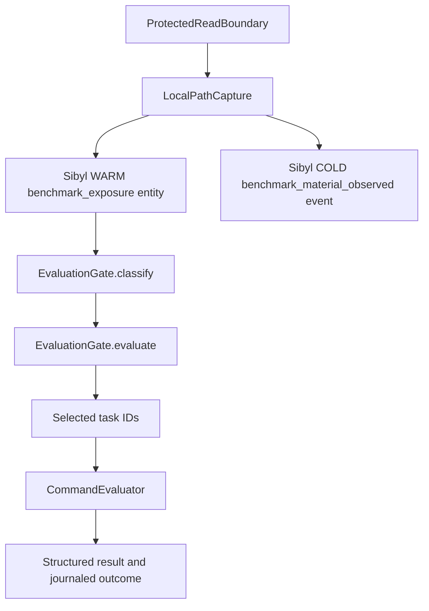

# Skepis

Skepis records objective exposure to protected benchmark material and uses that history to control what a later evaluation may count as clean.

Live demo: not available yet · Video: not available yet · Docs: this README · Repository: [GitHub](https://github.com/CryptoZephyr/Skepis) · Submission: not linked yet

No public screenshot, hosted application, public demo URL, or demo video is included. The product path runs locally from developer configuration and the configured Sibyl Memory client. The deterministic fixture remains a historical example.

Built with: Python 3.11+ · Sibyl Memory client · configured evaluator command · MCP SDK
Status: local proof complete, no public deployment

## The problem

An agent can read a hidden answer, protected test, solution patch, or other benchmark material while it is being developed. When that session ends, a later evaluator may have no record of the exposure. The task can then be counted as clean even though the evaluation is no longer fair.

## What Skepis does

Skepis keeps evaluation eligibility as durable state. A registered protected-resource read maps to one benchmark task, writes exposure to Sibyl, and leaves an append-only event. A fresh evaluation process reads that state and applies the benchmark policy.

The product invariant is simple:

> A task marked exposed by objective evidence cannot contribute to a clean score unless an explicit benchmark policy changes its eligibility.

## How it works

1. Register a benchmark, its task IDs, and its protected local paths.
2. Route a protected read through `skepis exposure read`.
3. Persist the exposure in Sibyl WARM state and append a COLD provenance event.
4. Start a fresh evaluation process. The policy gate partitions tasks into `CLEAN`, `EXPOSED`, and `UNKNOWN`, then hands only the allowed task set to the configured evaluator.

```mermaid
flowchart LR
    Register["Register benchmark and protected paths"] --> Read["Controlled protected read"]
    Read --> Capture["Objective exposure capture"]
    Capture --> Sibyl["Sibyl WARM state and COLD event"]
    Sibyl --> Gate["Fresh-session policy gate"]
    Gate --> Runner["Configured evaluator command"]
    Runner --> Result["Structured evaluator result"]
    Result --> Report["Portable clean evaluation report"]
```



## Evaluator contract

Normal benchmark registration does not require a fixture. Register the benchmark, semantic task IDs, protected paths, and a developer-supplied evaluator command. `skepis eval run` starts that command only after the policy gate selects the task set.

For example, a benchmark can register an evaluator with `skepis benchmark register --evaluator-command "python evaluate.py"`. The command can load its own benchmark data and choose its own scoring logic.

The command is run without a shell. Skepis provides the selected IDs in `SKEPIS_TASK_IDS` as JSON and writes the complete request to the file named by `SKEPIS_EVALUATION_REQUEST`. The request contains `benchmark_id`, `evaluation_subject`, `policy`, `run_id`, and `task_ids`. The command must return one JSON object on standard output with an `evaluated_tasks` array. It may add `metrics`, `score`, `details`, or other evaluator-defined fields.

Skepis rejects a result that names a task outside the policy-selected set. If the command evaluates only part of the selected set, the run is incomplete and no clean claim is permitted.

## Clean evaluation report

The report is the first product layer built on the generalized evaluator path. It is derived from the policy-gated run result and, when requested without an input file, the latest scoped terminal evaluation event in Sibyl. It does not recalculate eligibility or introduce a second policy decision.

Run an evaluation and save its JSON result, then render a portable Markdown artifact:

```bash
python -m skepis eval run --config skepis.toml --json > evaluation.json
python -m skepis report --input evaluation.json --format markdown --output skepis-report.md
```

After a run has been journaled, the report can also be rendered directly from the project and Sibyl state:

```bash
python -m skepis report --config skepis.toml
python -m skepis report --config skepis.toml --json
```

The JSON report includes the benchmark, evaluation subject, run ID, task eligibility partitions, selected and evaluated tasks, policy, score, clean-claim decision, journal provenance, and monitoring coverage. Raw evaluator `details`, extra fields, and non-scalar or sensitive metric values are omitted from the portable artifact. The report always exposes the known generic-agent boundary as `INCOMPLETE_MONITORING`.

## Read-only MCP preflight and inspection

The repository now includes two read-only MCP tools, `skepis_preflight` and `skepis_inspect`, served by `skepis-mcp` or `python -m skepis.mcp`. Both load the developer configuration and reuse the existing `EvaluationGate.classify` path. Preflight returns the scoped `CLEAN`, `EXPOSED`, and `UNKNOWN` partitions, memory and state availability, the configured policy for context, and monitoring coverage.

Inspect returns the same eligibility and monitoring view plus safe, scope-filtered exposure provenance. It includes only allowlisted event metadata and protected-read receipt fields. Raw event extras, protected contents, and sensitive evidence are omitted. Both tools are read-only. They do not read protected resources, write Sibyl state, journal a policy decision, run an evaluator, or expose a clean-claim result. Missing or mismatched Sibyl state remains `UNKNOWN` and `UNAVAILABLE`. Incomplete monitoring keeps otherwise-clean tasks `UNKNOWN`, and generic filesystem, Bash, browser, MCP, and Codex access remains `INCOMPLETE_MONITORING`.

Example MCP arguments:

```json
{
  "config_path": "skepis.toml",
  "task_ids": ["refund-idempotency", "oauth-refresh-expiry"]
}
```

Omit `task_ids` to classify and inspect every task registered in the configured benchmark. The MCP server exposes no other tools yet. The two-tool proof covers semantic task IDs, scope isolation, missing-store fail-closed behavior, incomplete monitoring, safe provenance redaction, and the absence of journal writes.

## Why Sibyl Memory matters

Sibyl is the durable boundary between the process that observes exposure and the process that evaluates the benchmark. WARM state stores current task eligibility. COLD events preserve exposure and evaluation history.

The proof depends on that boundary. After the memory database is removed, a fresh strict evaluation cannot recover the historical exposure. It returns `UNKNOWN`, selects no tasks, and blocks the clean claim.

## Try it

The fastest judge path is the repeatable Checkpoint 12 demo. It creates a fresh temporary project, registers the historical example evaluator through the generic command seam, shows a clean baseline, performs a controlled read of `checkout-17`, starts a new process to recall the exposure, runs `EXCLUDE`, and proves strict failure after deleting the exact local memory file.

```powershell
$env:PYTHONPATH = "src"
python demo/checkpoint12_demo.py --repeat 1
```

Use `--repeat 3` to run the full repeatability proof. The command prints one JSON record per stage, including process boundaries, capture evidence, task selection, score, and deletion behavior.

## Product / Demo

The current product surface is a local CLI plus two read-only MCP tools, preflight and inspect. There is no frontend, hosted endpoint, or public demo URL.

The repeatable demo is [demo/checkpoint12_demo.py](demo/checkpoint12_demo.py). Its fixture data and example-only evaluator are [examples/checkout-benchmark/fixture.json](examples/checkout-benchmark/fixture.json) and [examples/checkout-benchmark/evaluator.py](examples/checkout-benchmark/evaluator.py).

The continuous fresh-session video segment is deferred. It will be produced and published separately after the repository proof is stable.

## Prior Work

Skepis builds on the installed Sibyl Memory client, using `MemoryClient.local` as its durable WARM and COLD boundary. The protected-read boundary, deterministic eligibility gate, configured evaluator seam, deletion proof, and hardening tests are Skepis code in this repository. The fixture evaluator is kept for the historical demo and regression proof. The repository's first public proof commit is `a094a91`.

No prior public Skepis release, deployment, external user study, Base integration, or Virtuals Protocol integration is claimed.

## Architecture



Sibyl is authoritative for Skepis operational exposure state. The external read boundary is authoritative for the successful protected-file read. The configured evaluator is authoritative for its own task results. Model inference does not create hard exposure state.

## Integration details

| Technology | How we use it | Why it matters |
| --- | --- | --- |
| Sibyl Memory | `MemoryClient.local` stores the scoped WARM entity and COLD events | Exposure survives process and session boundaries |
| Python CLI | `skepis init`, `benchmark register`, `exposure status`, `exposure read`, `eval run`, and `report` | The proof and portable report are runnable without a web service |
| Local protected-read boundary | Opens the registered in-root file before creating the objective signal | The positive exposure claim has a concrete read receipt |
| Configured evaluator seam | Hands a developer command only the task IDs returned by the policy gate and validates its structured result | Real evaluation logic stays with the developer's benchmark |
| Portable clean report | Renders the canonical gate partitions and journaled evaluator result as terminal text, JSON, or Markdown | A shareable artifact can show eligibility, score, claim status, and monitoring limits without copying hidden answers |
| Read-only MCP preflight and inspect | Calls `EvaluationGate.classify` for the configured benchmark and projects scoped COLD provenance without journaling or running an evaluator | Agents can inspect eligibility and safe exposure evidence through the same core paths without a second policy engine |
| Historical fixture evaluator | Runs only in the example and regression proof | The old demo remains repeatable without defining normal registration |

## Proof map

| Judge claim | Exact implementation | Exact regression proof |
| --- | --- | --- |
| A protected read creates objective exposure | `src/skepis/capture/protected_read.py:ProtectedReadBoundary.read` calls `src/skepis/capture/local_path.py:LocalPathCapture.observe` | `tests/test_protected_read.py:ProtectedReadBoundaryTests.test_successful_read_returns_receipt_and_persists_evidence` |
| Sibyl writes survive the writer process | `src/skepis/capture/local_path.py:LocalPathCapture.observe` calls `MemoryClient.set_entity` and `MemoryClient.write_event` | `tests/test_capture.py:LocalPathCaptureTests.test_unique_mapping_writes_warm_and_cold` |
| A fresh process recalls exposure | `src/skepis/policy/gate.py:EvaluationGate._load_tasks` reads `MemoryClient.get_entity` and scoped COLD events | `tests/test_end_to_end.py:EndToEndProofTests.test_exposure_changes_fresh_session_task_selection` |
| Exposed tasks change the policy result | `src/skepis/policy/gate.py:EvaluationGate.evaluate` calls `_apply_policy` | `tests/test_policy.py:EvaluationGateTests.test_partitions_and_excludes_exposed_tasks` |
| The evaluator runs only the selected tasks | `src/skepis/eval/runner.py:run_evaluation` creates `EvaluationRequest` from `decision.selected_tasks`; `src/skepis/eval/evaluator.py:CommandEvaluator` validates the returned task IDs | `tests/test_generalized_evaluation.py:GeneralizedEvaluationTests.test_public_workflow_handles_unrelated_dynamic_benchmark_without_fixture` |
| The report comes from the canonical run and exposes monitoring limits | `src/skepis/report.py:build_report`, `src/skepis/report.py:load_latest_evaluation`, and `src/skepis/cli.py:_cmd_report` | `tests/test_report.py:ReportTests.test_report_reads_the_canonical_result_journaled_by_the_evaluation_runner` and `tests/test_generalized_evaluation.py:GeneralizedEvaluationTests.test_public_workflow_handles_unrelated_dynamic_benchmark_without_fixture` |
| MCP preflight and inspect reuse the classifier and remain read-only | `src/skepis/mcp.py:preflight` and `src/skepis/mcp.py:inspect` reuse `EvaluationGate.classify`; `src/skepis/mcp.py:create_server` registers exactly `skepis_preflight` and `skepis_inspect` | `tests/test_mcp.py:McpPreflightTests.test_stdio_protocol_exposes_two_read_only_tools_and_preserves_scope` and `tests/test_mcp.py:McpPreflightTests.test_stdio_inspect_redacts_provenance_and_preserves_incomplete_monitoring` |
| Removing Sibyl blocks a clean claim | `src/skepis/policy/gate.py:EvaluationGate._load_tasks` fails closed when WARM state is unavailable | `tests/test_deletion.py:DeletionProofTests.test_deleted_sibyl_state_fails_closed_in_fresh_session` |
| Known failure modes remain conservative | `src/skepis/capture/local_path.py:LocalPathCapture.mark_observation_gap` and `src/skepis/policy/gate.py:EvaluationGate._read_scoped_observation_gap` preserve uncertainty | `tests/test_hardening.py:HardeningTests.test_partial_warm_cold_write_failure_blocks_clean_claim` and `tests/test_hardening.py:HardeningTests.test_concurrent_capture_preserves_both_exposures` |
| The complete judge flow repeats without repair | `demo/checkpoint12_demo.py:_run_once` runs the fresh-project sequence | `tests/test_checkpoint12_demo.py:Checkpoint12DemoTests.test_demo_repeats_the_full_judge_proof_from_fresh_projects` |

### Sibyl entry points

- Write path: `LocalPathCapture.observe` writes the scoped `benchmark_exposure` entity with `MemoryClient.set_entity` and appends `benchmark_material_observed` with `MemoryClient.write_event`.
- Read path: `EvaluationGate._load_tasks` reads the WARM entity with `MemoryClient.get_entity` and checks scoped COLD gaps with `MemoryClient.read_events`.
- Decision path: `EvaluationGate.evaluate` applies `EXCLUDE`, `FLAG`, or `STRICT` through `_apply_policy` before `run_evaluation` invokes the configured evaluator.

## What's running

- Local WSL development environment with Python 3.14.4.
- Sibyl Memory client 0.7.0 in the verified environment.
- No public deployment, hosted API, smart contract, or network-specific integration.
- Public GitHub repository: [CryptoZephyr/Skepis](https://github.com/CryptoZephyr/Skepis).

## Evidence

The current evidence was verified on 2026-09-01 in this working tree. The public proof baseline is commit `a094a91` (`Initial public Skepis proof`) on `main`. The generalized evaluation gate is published in commit `b31b8456da6916f9543db092b9625d5372e73fcc`, and the portable report gate is published in commit `910be72c12d3cdfff76d84afe7289c2c0d7957b7`.

- `demo/checkpoint12_demo.py --repeat 3` completed three fresh temporary projects without repair.
- Each repeat started with `checkout-16`, `checkout-17`, and `checkout-18` clean.
- Session A recorded a controlled `checkout-17` read with a persisted Sibyl event ID and content hash.
- Fresh Session B recalled only `checkout-17` as `EXPOSED`.
- `EXCLUDE` evaluated only `checkout-16` and `checkout-18`, with score `1.0`.
- Exact memory deletion followed by fresh `STRICT` evaluation returned `BLOCKED`, all tasks `UNKNOWN`, no selected or evaluated tasks, and `clean_claim_permitted: false`.
- The generalized proof registered a nine-task benchmark with semantic IDs, two protected-resource patterns, no fixture, and a developer evaluator command. A fresh process recalled one exposed task and the evaluator received the other eight under `EXCLUDE`.
- The generalized proof also read the resulting run through `skepis report`, producing a report with eight evaluated tasks and an explicit `INCOMPLETE_MONITORING` generic-agent boundary.
- The read-only MCP preflight and inspect proof exposed exactly two tools, classified a five-task semantic benchmark, preserved tenant scope isolation, returned `UNKNOWN` for a missing store, redacted raw provenance, preserved incomplete-monitoring uncertainty, and emitted no COLD journal writes.
- The configured WSL suite passed 79 tests with 0 skips.
- The Windows suite passed 79 tests with 9 dependency-based skips. Seven skips are fresh-process Sibyl proofs and two are MCP protocol proofs because its interpreter cannot import the configured Sibyl client.
- The release boundary was checked against the current [official hackathon rules](https://hack.sibyllabs.org/rules): public GitHub repository, OSI-approved license, real commit history, proof-mapped README, Prior Work declaration, fresh-session recall evidence, timestamp or commit evidence, and two public posts. The two posts remain intentionally unsubmitted.

The complete automated demo assertion is [tests/test_checkpoint12_demo.py](tests/test_checkpoint12_demo.py). The broader source tests are in [tests](tests).

## Failure cases / What we tested

| Attempt | Expected behavior | Result |
| --- | --- | --- |
| Protected `checkout-17` read | Persist exposure and provenance | `RECORDED`, WARM `EXPOSED`, COLD event present |
| `EXCLUDE` after exposure | Keep exposed task out of clean evaluation | `checkout-17` excluded, clean tasks evaluated |
| Missing or deleted Sibyl state | Fail closed | `UNKNOWN`, `BLOCKED` under `STRICT`, no clean claim |
| Failed or ambiguous protected read | Avoid hard exposure and report uncertainty | Read rejected or `INCOMPLETE_MONITORING` gap recorded |
| Missing observation reader or failed gate journal | Avoid a clean claim | Unknown state or unjournaled decision blocks the claim |
| Evaluator returns an unauthorized or partial task set | Keep execution bound to policy selection | Run fails or remains incomplete, with no clean claim |
| Report input contains evaluator details or hidden-answer fields | Keep the portable artifact safe and single-sourced | Details and non-scalar or sensitive metrics are omitted, while the canonical score and task partitions remain |
| Generic Bash, scripts, MCP, or unsupported Codex routes | Avoid claiming coverage that was not observed | Remain outside the bounded adapter as `INCOMPLETE_MONITORING` |

## Repository structure

```text
.
├── demo/
│   └── checkpoint12_demo.py
├── examples/
│   └── checkout-benchmark/
│       ├── evaluator.py
│       └── fixture.json
├── pyproject.toml
├── src/
│   └── skepis/
│       ├── capture/
│       ├── cli.py
│       ├── config.py
│       ├── eval/
│       ├── policy/
│       └── report.py
└── tests/
```

## Run locally

Create an isolated environment and install the package from the repository root:

```bash
python -m venv .venv
source .venv/bin/activate
python -m pip install -e .
export PYTHONPATH=src
python -m unittest discover -s tests -v
python demo/checkpoint12_demo.py --repeat 3
```

PowerShell uses the same commands with this environment variable form:

```powershell
python -m venv .venv
.\.venv\Scripts\Activate.ps1
python -m pip install -e .
$env:PYTHONPATH = "src"
python -m unittest discover -s tests -v
python demo/checkpoint12_demo.py --repeat 3
```

The deterministic demo needs the Sibyl Memory client declared in [pyproject.toml](pyproject.toml). The authenticated `sibyl` command is used for environment health checks and is not required to run the local example evaluator once the client is installed.

## Limitations

- The only proven hard-exposure route is the controlled `skepis exposure read` command.
- Generic filesystem, Bash, script, MCP, and Codex activity is not objectively observed by this adapter and remains `INCOMPLETE_MONITORING`.
- The configured command seam does not supply model scoring or an Inspect AI integration. The example fixture evaluator is deterministic proof code only.
- The portable report is local and consumes a saved run result or the latest scoped Sibyl evaluation event. It does not add an MCP report or run interface, and it does not claim generic agent telemetry.
- There is no frontend, hosted service, public demo URL, or demo video.
- The verified environment is local. The local Sibyl store reports the FREE tier while the authenticated server reports a STAKE subscription. The local proof does not depend on upgrading the local tier.

## Roadmap

- Publish the demo video and build-log post only when explicitly authorized.
- Complete PMF evidence separately. No external tester or public usage claim is made here.
- Keep generic Codex activity, model scoring, Inspect AI, frontend, hosting, and partner integrations outside the proven surface until their own gates are met.

Posts and public release operations are intentionally skipped in this pass.

## License

This project is released under the [MIT License](LICENSE).
