# Skepis

An agent can read a hidden answer, protected test, solution patch, or other benchmark material while it is being developed. A later evaluator can then count that task as clean without knowing what happened in the earlier session.

Skepis keeps task eligibility as durable, evidence-backed state. The preferred developer journey is:

```text
npx skepis init
skepis connect

# work normally

skepis eval

# only when an explanation is needed
skepis inspect
```

## Quick start

Run this from the project you want to evaluate:

```bash
npx skepis init
skepis connect
```

For a persistent installation, use:

```bash
npm install -g skepis
skepis init
```

`init` asks for the benchmark identity, agent or evaluation subject, task IDs, protected-resource mappings, and evaluator command. It creates the canonical project configuration, uses `EXCLUDE` by default, and checks that Sibyl Memory is available. A short summary ends with `Next: skepis connect`.

`connect` detects a supported project-scoped client from its installed host command or existing project configuration, adds the existing Skepis stdio server without disturbing other MCP servers or host settings, installs one short project instruction, and checks that all five Skepis tools are discoverable. It does not run a full evaluation during connection. If no supported client is detected, it prints a safe manual JSON configuration.

The npm launcher requires Node.js 18 or newer and finds Python 3.11 or newer. It creates a private per-user Python environment for the existing Skepis implementation and its dependencies. Developers who already use Python can install the package directly instead.

The noninteractive form is useful for CI or a clean setup proof:

```bash
npx skepis init \
  --root . \
  --benchmark-id payments-regression \
  --evaluation-subject payments-agent \
  --task refund-idempotency \
  --task oauth-refresh-expiry \
  --protected refund-idempotency=private/answers/refund.yaml \
  --evaluator-command "python evaluate.py"
```

## Work normally

Skepis does not run a daemon, watcher, generic telemetry service, or custom agent plugin after setup. Ordinary source access remains ordinary source access.

When the coding agent uses the supported Skepis protected-read MCP tool for a registered resource, the existing `ProtectedReadBoundary` checks the path, reads it, and only then records objective exposure. The result is persisted through Sibyl and survives process and session boundaries.

The intended consequence is concise:

```text
Skepis: oauth-refresh-expiry was exposed.
It will not count as clean evaluation evidence.
```

Direct filesystem, Bash, browser, internal-tool, unsupported MCP, and unsupported coding-agent routes remain `INCOMPLETE_MONITORING`. Skepis never presents those routes as universal observation.

## Evaluate once

`skepis eval` is the normal human evaluation action. It loads the registered task set, reads the existing Sibyl state, classifies tasks, applies the configured policy, runs the developer evaluator with only the selected task IDs, and builds the canonical report.

The human output starts with the result, then gives the reason and monitoring boundary:

```text
Skepis Evaluation

payments-agent x payments-regression

18 requested
16 clean
2 previously exposed

Evaluating 16 clean tasks...

Passed: 14 / 16
Score: 0.875
2 exposed tasks excluded

Clean claim: permitted
```

The command keeps evaluator performance separate from eligibility. An exposed task can be excluded by policy while the clean claim remains permitted for the selected tasks. `UNKNOWN` stays unknown and blocks a clean claim when the evidence boundary is incomplete.

The fail-closed form is concise as well:

```text
Clean evaluation could not be established.

15 clean
2 previously exposed
1 unknown

Monitoring history is incomplete, so unknown tasks cannot support a clean claim.

Run `skepis inspect` for details.
```

Use `--json` when another program needs the full safe result:

```bash
skepis eval --json
```

The older `skepis eval run` spelling remains available for scripts and existing integrations.

## Inspect when needed

`skepis inspect` is an optional explanation path. It is read-only and does not journal a policy decision or alter exposure state.

```bash
skepis inspect
skepis inspect --json
```

Human output explains why each requested task is clean, exposed, or unknown. JSON keeps the safe, scope-filtered provenance projection for advanced use. Protected contents, raw evaluator payloads, unrelated tasks and tenants, and private failure details are redacted.

## Project MCP connections

Skepis configures only project-scoped files in the supported matrix:

| Client | MCP config | Project instruction |
| --- | --- | --- |
| Claude Code | `.mcp.json` | `CLAUDE.md` |
| Cursor | `.cursor/mcp.json` | `.cursor/rules/skepis.mdc` |
| Codex | `.codex/config.toml` | `AGENTS.md` |
| Antigravity | `.agents/mcp_config.json` | `.agents/rules/skepis.md` |
| Gemini CLI | `.gemini/settings.json` | `GEMINI.md` |

All five clients use the same existing five-tool stdio server. The connector preserves other entries and settings, writes the canonical absolute config path into the Skepis server command, and verifies the expected tool names after the change. Codex TOML is merged semantically, so comments and formatting may be normalized while settings remain preserved.

The installed project instruction is deliberately short:

```text
When accessing benchmark resources registered as protected by Skepis, use the Skepis protected-read MCP tool rather than reading them directly. Use Skepis for evaluation runs involving the configured benchmark.
```

This instruction guides the agent. It does not intercept arbitrary direct filesystem, Bash, browser, or other tool access.

If no supported client is detectable, `skepis connect` returns a manual configuration block. It does not silently write a global client setting or claim that an unsupported client is connected.

## Advanced MCP surface

The human CLI is the primary product surface. Agents and advanced workflows can use the existing five tools through `skepis-mcp` or `python -m skepis.mcp`:

| Tool | Role | State change |
| --- | --- | --- |
| `skepis_run` | Run the configured evaluator through the policy gate | Journals evaluation events |
| `skepis_preflight` | Classify requested tasks before an evaluation | Read-only |
| `skepis_inspect` | Explain eligibility with safe provenance | Read-only |
| `skepis_report` | Retrieve the latest or selected portable report | Read-only |
| `skepis_read_protected` | Read one registered protected resource through the capture boundary | Records objective exposure |

`skepis_run` uses the evaluator in the project configuration and never accepts a caller-supplied evaluator. `skepis_read_protected` records exposure only after a successful registered read. The MCP server accepts `--config` so a project connection can set one canonical configuration for calls that omit `config_path`.

## Evaluator contract

Normal benchmark setup does not require a fixture. Register semantic task IDs, protected paths, and a developer-supplied evaluator command. The command can load its own benchmark data and choose its own scoring logic.

The evaluator runs without a shell. Skepis provides the selected IDs in `SKEPIS_TASK_IDS` as JSON and writes the complete request to the file named by `SKEPIS_EVALUATION_REQUEST`. The request contains `benchmark_id`, `evaluation_subject`, `policy`, `run_id`, and `task_ids`.

The command must return one JSON object on standard output with an `evaluated_tasks` array. It may add `metrics`, `score`, `details`, or other evaluator-defined fields. Skepis rejects a result that names a task outside the policy-selected set. A partial result remains incomplete and cannot support a clean claim.

## Reports

Reports are derived from the canonical policy-gated run. They do not recalculate eligibility or introduce a second policy decision.

Retrieve the latest scoped report after `skepis eval`:

```bash
skepis report --json
skepis report --format markdown --output skepis-report.md
```

The portable report includes the benchmark, evaluation subject, run ID, task partitions, selected and evaluated tasks, policy, score, clean-claim decision, journal markers, and monitoring coverage. Raw evaluator details, protected content, and sensitive metric fields are omitted.

## The invariant

> A task marked exposed by objective evidence cannot contribute to a clean score unless an explicit benchmark policy changes its eligibility.

The implementation preserves the existing Sibyl, capture, policy, evaluator, report, and MCP seams:

```mermaid
flowchart LR
    Init["skepis init"] --> Connect["skepis connect"]
    Connect --> Work["Normal agent work"]
    Work --> Read["Registered protected read"]
    Read --> Capture["Objective exposure capture"]
    Capture --> Sibyl["Sibyl WARM state and COLD event"]
    Sibyl --> Gate["Fresh-session policy gate"]
    Gate --> Eval["Configured evaluator"]
    Eval --> Report["Canonical safe report"]
    Report --> Inspect["Optional skepis inspect"]
```



Sibyl is authoritative for operational exposure state. The protected-read boundary is authoritative for the successful local read. The configured evaluator is authoritative for its task results. Model inference does not create hard exposure state.

## Python installation

Python developers can use the canonical implementation directly:

```bash
python -m venv .venv
source .venv/bin/activate
python -m pip install -e .
export PYTHONPATH=src
python -m skepis init
python -m skepis connect
python -m skepis eval
```

PowerShell uses the same commands with `$env:PYTHONPATH = "src"`. The Python path and npm path call the same implementation. There is no Node policy, state, capture, evaluator, report, or MCP implementation.

## Evidence

The current evidence covers:

- The complete WSL suite, including the three-adapter project connection journey and the existing Sibyl, capture, policy, evaluator, report, MCP stdio, deletion, scope, and regression proofs.
- The Windows suite, with dependency-based skips where the system interpreter cannot import the configured Sibyl client.
- The published `skepis@0.1.4` package, with a public `npx skepis@0.1.4 --help` smoke check from an unrelated temporary directory.
- A packed npm artifact installed into a separate temporary project.
- `npx --no-install skepis init` and `skepis connect` from that installed artifact without checkout-relative paths.
- A clean Windows npm journey using the detected Claude Code project surface, the five-tool MCP server, a successful protected read, a fresh evaluation process, safe report and inspect output, and strict failure after exact Sibyl state deletion.
- Codex, Antigravity, and Gemini CLI project adapters with idempotent configuration, existing-setting preservation, malformed-config refusal, MCP handshake verification, five-tool discovery, protected-read capture, fresh-session recall, policy-gated evaluation, inspect, and report.
- Arbitrary semantic task IDs and dynamic task counts without a fixture in the normal evaluator path.

The release proof covers Windows and WSL/Linux. The launcher uses Windows and POSIX process paths, but macOS has not been run in this environment and is not claimed as independently verified.

Run the opt-in distribution proof explicitly:

```powershell
$env:PYTHONPATH = "src"
$env:SKEPIS_RUN_NPM_E2E = "1"
python -m unittest tests.test_npm_journey -v
```

The historical deterministic example remains available for regression coverage:

```powershell
$env:PYTHONPATH = "src"
python demo/checkpoint12_demo.py --repeat 3
```

The example fixture evaluator is proof code only. It does not define the normal production evaluator path.

## Limits

- Protected-read capture covers registered in-root resources through the supported CLI and MCP boundary.
- Supported project-local MCP connections cover Claude Code, Cursor, Codex, Antigravity, and Gemini CLI. Generic filesystem, Bash, browser, internal-tool, unsupported MCP, and unsupported coding-agent activity remains `INCOMPLETE_MONITORING`.
- Missing or mismatched Sibyl state remains `UNKNOWN` and `UNAVAILABLE`.
- Incomplete monitoring, incomplete evaluator coverage, evaluator failure, and unjournaled decisions cannot produce a clean claim.
- The evaluator seam does not provide model scoring or an Inspect AI integration.
- The report is local and uses the latest scoped Sibyl evaluation event or an explicit saved run input.
- There is no frontend, hosted service, public API, dashboard, or generic telemetry platform.

## Security

See [SECURITY.md](SECURITY.md) for reporting guidance and the project's trust boundaries.

## Repository

```text
.
├── npm/
│   ├── skepis.js
│   └── skepis-mcp.js
├── demo/
│   └── checkpoint12_demo.py
├── examples/
│   └── checkout-benchmark/
├── package.json
├── pyproject.toml
├── src/
│   └── skepis/
│       ├── capture/
│       ├── cli.py
│       ├── config.py
│       ├── eval/
│       ├── integration.py
│       ├── policy/
│       └── report.py
└── tests/
```

## License

This project is released under the [MIT License](LICENSE).
